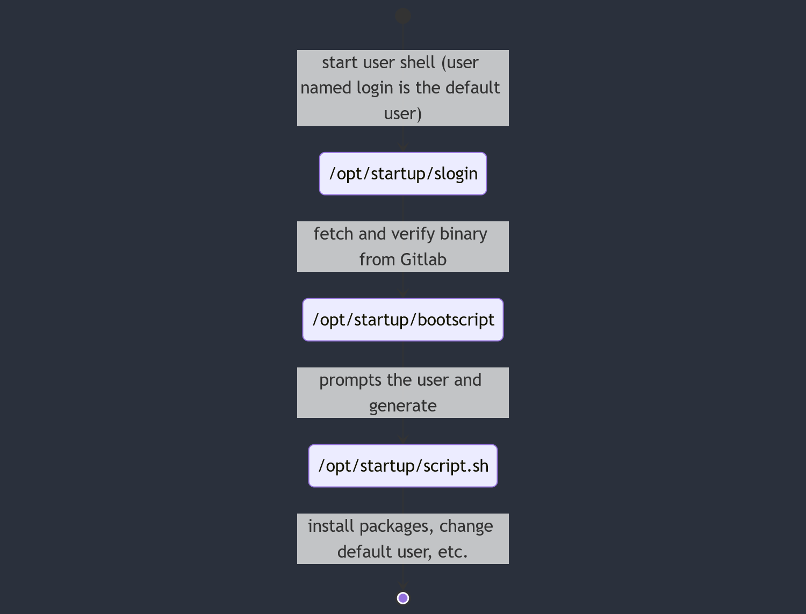

# Arch Avisto WSL

This project contains the sources and the documentation to ship updates of the
Arch Avisto image.

For documentation about the [installation](https://advans-group.atlassian.net/wiki/spaces/DS/pages/2919563271/WSL+2+Get+started#%F0%9F%86%95-Import-Avisto-image-[Recommended]) as a consumer.

## Setup

### Pre-commit

This project uses pre-commit tool [documentation](https://pre-commit.com/).

The goal is to run scripts or tasks (called hooks) on a commit basis
(e.g. linting, small checks, documentation as code, etc.).

For this purpose, pre-commit will execute all the hooks declared in in then
`.pre-commit-config.yaml` configuration file.

1. Install the tool. `pip install pre-commit`
2. Install the git hook. `pre-commit install`
3. Verify it is working by running pre-commit hooks. `pre-commit run --all-files`

### Golang

The bootscript is written in [Golang](https://golang.org/)

## Introduction

### History

The aim of Arch Avisto was to deliver a container solution (docker in our case)
out-of-the box for the teams without relaying on Docker Desktop,
for licence reasons. Indeed, its installation on WSL was error prone and time consuming.

Arch Avisto is based on [Arch Linux](https://archlinux.org/), and its first
version was born using [ArchWSL](https://github.com/yuk7/ArchWSL).

### Architecture

There are two users in this image

- `arch` is the normal user.
- `login` is the default user on the first launch. Its job is to launch the bootscript.

They are a few important files on the Arch Avisto WSL image.

Static files:

- `/home/arch` is the home of the default user, containing `.oh-my-zsh`,
  `.zshrc` and `.config/starship.toml` as basic configuration
- `/opt/prep.sh` is a script to prepare the image (clearing history and caches). It should be manually used before exporting.
- `/usr/bin/slogin` is the shell of the `login` user. This shell is responsible to download and run `bootscript`, then start the bash script generated by `bootscript`

Other files:

- `/opt/startup/bootscript` is the binary executed by `slogin`
  on startup, it will be fetched from the Gitlab package registry and is
  responsible to prompt the user for the packages he wants, his username, etc.
- `/opt/startup/script.sh` is the script generated by the binary `bootscript` and executed by `slogin`, it contains all bash commands that will set up the images

> ⓘ **Note**
> The bootscript will try to fetch and parse the file `packagesProfiles.json`
> located in the Gitlab repository in order to prompt the user the latest
> packages without having to rebuild an image



### CI/CD

The Gitlab CI/CD of this project is responsible of building the bootscript,
signing it and publish it to the package registry.
As Gitlab does not have any system to simply get the latest version of a package,
the CI will push 2 versions of the package on tags:

- One with a version number (the short commit sha in our case) for test purposes
- One with the `latest` version that will be downloaded by the `slogin` script

Additionally, the CI will also publish the signature of the bootscript in
another package that will have the same version name.

> ⓘ **Note**
> As Gitlab does not have a system to get the latest version of a package, \
> the pipeline always delete the previous `latest` package before pushing the new one.
> This can lead to a situation where the latest version is deleted but not pushed.
> That's why it is important to ensure the pipeline finishes successfully.

## Step-by-step guide to ship new version

> Before starting be sure you run the latest WSL version (see [doc](https://advans-group.atlassian.net/wiki/spaces/DS/pages/2919563271/WSL+2+Get+started#Install%2FUpdate-WSL-2)). \
> Also install [7-zip](https://www.7-zip.org/).

1. Download the latest version from [SharePoint](https://groupadvans.sharepoint.com/:f:/s/DevOpsSupport/ErkpQpmnXEtNnZbT5MnMVE8BOESKO38rK_BXh-luBE0gTA?e=6HTMM0)
2. Use the [documentation](https://advans-group.atlassian.net/wiki/spaces/DS/pages/2919563271/WSL+2+Get+started#%F0%9F%86%95-Import-Avisto-image-[Recommended])
   to import the image, then login using `wsl -u arch -d <distro-name>`
3. Do your changes
4. Update the version in `/opt/startup/slogin` file
5. Prep the image by running `source /opt/prep.sh`
6. Confirm your history is empty (^R), otherwise run the content of `/opt/prep.sh` manually
7. Open a Powershell
8. Shutdown wsl with `wsl --terminate <distro-name>`
9. Export the distribution as a compressed archive (see the command below)
10. Upload it to the SharePoint (step 1)
11. Make at least 1 person test it
12. Change SharePoint link on the documentation (step 2) to point to the new version

```powershell
# Export the distribution as a compressed archive
wsl --export <distro-name> .\arch_avisto_v<semver>.tar
& "C:\Program Files\7-Zip\7z.exe" a .\arch_avisto_v<semver>.tar.gz .\arch_avisto_v<semver>.tar
```
